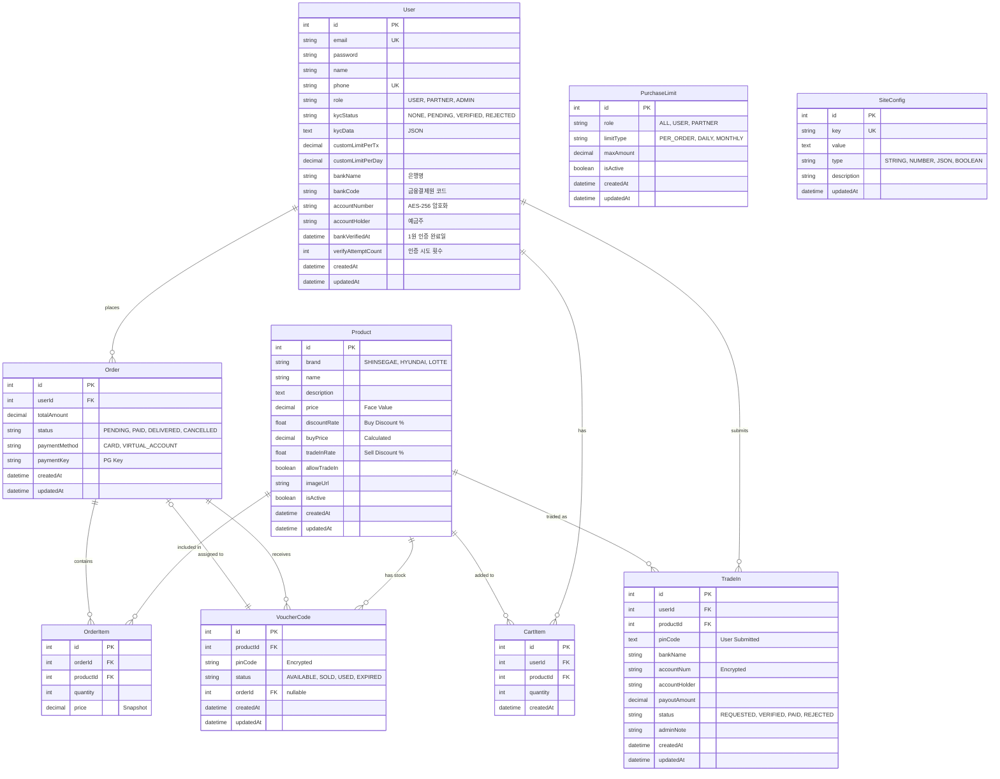

# 03. Entity Relationship Diagram (ERD)

## 1. 스키마 시각화



---

## 2. 테이블 사전

### 2.1 User (`users`)

| 컬럼 | 타입 | 설명 |
|------|------|------|
| `id` | INT PK | 자동 증가 ID |
| `email` | VARCHAR UNIQUE | 로그인 이메일 |
| `password` | VARCHAR | bcrypt 해시 |
| `name` | VARCHAR | 사용자 이름 |
| `phone` | VARCHAR UNIQUE | 휴대폰 번호 |
| `role` | VARCHAR | USER, PARTNER, ADMIN |
| `kycStatus` | VARCHAR | NONE, PENDING, VERIFIED, REJECTED |
| `kycData` | TEXT | KYC 문서 JSON |
| `customLimitPerTx` | DECIMAL | 개인 1회 한도 |
| `customLimitPerDay` | DECIMAL | 개인 일일 한도 |
| `bankName` | NVARCHAR(50) | 은행명 (예: 국민은행) |
| `bankCode` | VARCHAR(10) | 금융결제원 표준 코드 (예: 004) |
| `accountNumber` | NVARCHAR(500) | 계좌번호 (AES-256 암호화 저장) |
| `accountHolder` | NVARCHAR(50) | 예금주명 |
| `bankVerifiedAt` | DATETIME | 1원 인증 완료 시간 |
| `verifyAttemptCount` | INT | 1원 인증 시도 횟수 (기본값: 0) |

**역할 설명:**
- `USER`: 일반 사용자, KYC 인증 필요
- `PARTNER`: 대량 할인 파트너
- `ADMIN`: 시스템 관리자

### 2.2 Product (`products`)

| 컬럼 | 타입 | 설명 |
|------|------|------|
| `id` | INT PK | 자동 증가 ID |
| `brand` | VARCHAR | 상품권 브랜드 |
| `name` | VARCHAR | 상품명 |
| `description` | TEXT | 상품 설명 |
| `price` | DECIMAL(10,2) | 액면가 |
| `discountRate` | FLOAT | 판매 할인율 (%) |
| `buyPrice` | DECIMAL(10,2) | 실 판매가 |
| `tradeInRate` | FLOAT | 매입율 (%) |
| `allowTradeIn` | BOOLEAN | 매입 허용 여부 |
| `imageUrl` | VARCHAR | 상품 이미지 URL |
| `isActive` | BOOLEAN | 활성화 여부 |

**브랜드 코드:**
```
SHINSEGAE  - 신세계
HYUNDAI    - 현대
LOTTE      - 롯데
DAISO      - 다이소
OLIVEYOUNG - 올리브영
```

### 2.3 VoucherCode (`voucher_codes`)

| 컬럼 | 타입 | 설명 |
|------|------|------|
| `id` | INT PK | 자동 증가 ID |
| `productId` | INT FK | 상품 참조 |
| `pinCode` | NVARCHAR(500) | AES 암호화된 PIN |
| `status` | VARCHAR | 상태 코드 |
| `orderId` | INT FK | 판매된 주문 (nullable) |

**상태 코드:**
- `AVAILABLE`: 판매 가능
- `SOLD`: 판매됨
- `USED`: 사용됨
- `EXPIRED`: 만료됨

### 2.4 Order (`orders`)

| 컬럼 | 타입 | 설명 |
|------|------|------|
| `id` | INT PK | 자동 증가 ID |
| `userId` | INT FK | 주문자 |
| `totalAmount` | DECIMAL(10,2) | 총 결제 금액 |
| `status` | VARCHAR | 주문 상태 |
| `paymentMethod` | VARCHAR | 결제 수단 |
| `paymentKey` | VARCHAR | PG 결제 키 |

**주문 상태:**
- `PENDING`: 결제 대기
- `PAID`: 결제 완료
- `DELIVERED`: 발송 완료
- `CANCELLED`: 취소됨

### 2.5 OrderItem (`order_items`)

| 컬럼 | 타입 | 설명 |
|------|------|------|
| `id` | INT PK | 자동 증가 ID |
| `orderId` | INT FK | 주문 참조 |
| `productId` | INT FK | 상품 참조 |
| `quantity` | INT | 수량 |
| `price` | DECIMAL(10,2) | 구매 시점 가격 (스냅샷) |

### 2.6 TradeIn (`trade_ins`)

| 컬럼 | 타입 | 설명 |
|------|------|------|
| `id` | INT PK | 자동 증가 ID |
| `userId` | INT FK | 신청자 |
| `productId` | INT FK | 매입 상품 |
| `pinCode` | TEXT | 제출된 PIN (암호화) |
| `bankName` | VARCHAR | 은행명 |
| `accountNum` | VARCHAR | 계좌번호 (암호화) |
| `accountHolder` | VARCHAR | 예금주 |
| `payoutAmount` | DECIMAL(10,2) | 매입 금액 |
| `status` | VARCHAR | 처리 상태 |
| `adminNote` | VARCHAR | 관리자 메모 |

**매입 상태:**
- `REQUESTED`: 신청됨
- `VERIFIED`: 검증 완료
- `PAID`: 지급 완료
- `REJECTED`: 거절됨

### 2.7 CartItem (`cart_items`)

| 컬럼 | 타입 | 설명 |
|------|------|------|
| `id` | INT PK | 자동 증가 ID |
| `userId` | INT FK | 사용자 참조 |
| `productId` | INT FK | 상품 참조 |
| `quantity` | INT | 수량 |

### 2.8 PurchaseLimit (`purchase_limits`) - 신규

| 컬럼 | 타입 | 설명 |
|------|------|------|
| `id` | INT PK | 자동 증가 ID |
| `role` | VARCHAR | 적용 대상 (ALL, USER, PARTNER) |
| `limitType` | VARCHAR | 한도 유형 |
| `maxAmount` | DECIMAL(10,2) | 최대 금액 |
| `isActive` | BOOLEAN | 활성화 여부 |

**한도 유형:**
- `PER_ORDER`: 1회 주문 최대
- `DAILY`: 일일 누적 최대
- `MONTHLY`: 월간 누적 최대

### 2.9 SiteConfig (`site_configs`)

| 컬럼 | 타입 | 설명 |
|------|------|------|
| `id` | INT PK | 자동 증가 ID |
| `key` | VARCHAR UNIQUE | 설정 키 |
| `value` | TEXT | 설정 값 |
| `type` | VARCHAR | 값 타입 |
| `description` | VARCHAR | 설명 |

**설정 예시:**
```json
{ "key": "NOTICE_BANNER", "value": "이벤트 진행 중!", "type": "STRING" }
{ "key": "MAINTENANCE_MODE", "value": "false", "type": "BOOLEAN" }
{ "key": "TRADE_IN_ENABLED", "value": "true", "type": "BOOLEAN" }
```

---

## 3. 인덱스 설계

```sql
-- VoucherCode: 상품별 가용 재고 조회 최적화
CREATE INDEX idx_voucher_product_status ON voucher_codes(productId, status);

-- Order: 사용자별 주문 조회
CREATE INDEX idx_order_user ON orders(userId);

-- TradeIn: 사용자별 매입 조회
CREATE INDEX idx_tradein_user ON trade_ins(userId);

-- CartItem: 사용자별 장바구니 조회
CREATE INDEX idx_cart_user ON cart_items(userId);
```

---

## 4. 관계 요약

| 관계 | 설명 |
|------|------|
| User → Order | 1:N (사용자가 여러 주문 생성) |
| User → TradeIn | 1:N (사용자가 여러 매입 신청) |
| User → CartItem | 1:N (사용자의 장바구니) |
| Product → VoucherCode | 1:N (상품별 PIN 재고) |
| Product → OrderItem | 1:N (상품이 여러 주문에 포함) |
| Product → TradeIn | 1:N (상품별 매입 요청) |
| Order → OrderItem | 1:N (주문에 여러 상품) |
| Order → VoucherCode | 1:N (주문에 PIN 할당) |

---

## 5. Prisma Schema 동기화

현재 `server/prisma/schema.prisma` 파일이 이 ERD와 동기화되어 있습니다.

**추가 필요 테이블:**
- `PurchaseLimit` - 구매 한도 설정 (Prisma 스키마에 추가 필요)

```prisma
// [Planned] Role-based Limit Table (Currently using SiteConfig + User Custom Limits)
// model PurchaseLimit {
//   id        Int      @id @default(autoincrement())
//   role      String   // ALL, USER, PARTNER
//   limitType String   // PER_ORDER, DAILY, MONTHLY
//   maxAmount Decimal  @db.Decimal(10, 2)
//   isActive  Boolean  @default(true)
//   createdAt DateTime @default(now())
//   updatedAt DateTime @updatedAt
//   @@map("purchase_limits")
// }
```

---

## 6. 참조 문서

- [01_PRD.md](./01_PRD.md) - 요구사항 정의서
- [02_ARCHITECTURE.md](./02_ARCHITECTURE.md) - 시스템 아키텍처
- [05_API_SPEC.md](./05_API_SPEC.md) - API 명세서
