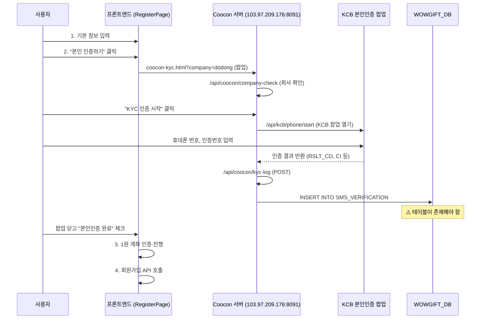

# KYC 본인인증 통합 가이드

## 개요

외부 KYC 서비스(Coocon/KCB)를 통해 본인인증을 수행하고, 결과를 `WOWGIFT_DB`의 `SMS_VERIFICATION` 테이블에 저장하는 구조입니다.

---

## 인증 흐름



---

## Coocon KYC 페이지 분석

### URL

```
http://103.97.209.176:8091/coocon-kyc.html?company=dodong
```

### 사용하는 API 엔드포인트 (Coocon 서버)

| API                                              | 메서드 | 용도                        |
| ------------------------------------------------ | ------ | --------------------------- |
| `/api/coocon/company-check?company=dodong`       | GET    | 회사 코드 유효성 확인       |
| `/api/kcb/phone/start?kcbAuthId=...&company=...` | GET    | KCB 본인인증 팝업 시작      |
| `/api/kcb/checkStatus?kcbAuthId=...`             | GET    | 인증 상태 폴링 (1.5초 간격) |
| `/api/coocon/kyc-log`                            | POST   | 인증 결과를 DB에 저장       |

### `/api/coocon/kyc-log`에 전송되는 데이터 → DB 컬럼 매핑

```json
{
  "company": "dodong",         // → DB에 저장되지 않음 (컬럼 없음)
  "affId": null,               // → _AFFILIATE_ID
  "name": "홍길동",            // → _BANKUSER
  "birth": "19900101",         // → _BIRTH
  "gender": "1",               // → _GENDER
  "nationality": "L",          // → _NATIONALITY
  "ci": "연계정보(CI) 해시값", // → _CI
  "telco": "SKT",              // → _TELCO
  "phone": "01012345678"       // → _PHONE
}
```

> **주의**: `company` 필드는 Coocon 서버 내부에서 사용되며 SMS_VERIFICATION에는 저장되지 않습니다.
> `_BANKCODE`, `_BANKNUMBER`는 테이블에 존재하지만 Coocon이 INSERT하지 않아 항상 빈 문자열입니다.

---

## SMS_VERIFICATION 테이블

### 현재 상태

- **Prisma 스키마에 존재 여부**: ✅ `SmsVerification` 모델 (`@@map("SMS_VERIFICATION")`)
- **DB에 존재 여부**: ✅ 2026-02-21 생성 완료
- **Coocon 서버 연동**: ✅ `http://103.97.209.176:8091/coocon-kyc.html?company=dodong`에서 인증 시 자동 INSERT

### 테이블 스키마 (실제 프로덕션 DB 기준 — 2026-03-25 확인)

> Coocon 서버(103.97.209.176:8091)가 KCB 인증 완료 시 직접 INSERT합니다.
> 컬럼명은 Coocon 내부 규격(`_` 접두사 + UPPERCASE)을 따릅니다.

```sql
-- 실제 프로덕션 DB 스키마 (SMS_VERIFICATION)
-- PK: _UNIQUEID (bigint, identity)
-- Coocon 서버가 직접 INSERT하므로 컬럼명 변경 불가
CREATE TABLE SMS_VERIFICATION (
    _UNIQUEID       BIGINT IDENTITY(1,1) PRIMARY KEY,  -- Coocon 내부 PK
    _AFFILIATE_ID   NVARCHAR(20)  NULL DEFAULT '',      -- 제휴사 ID
    _DATETIME       DATETIME      NULL DEFAULT GETDATE(),-- 인증 일시
    _BANKCODE       NVARCHAR(5)   NULL DEFAULT '',      -- 은행 코드 (Coocon 미사용, 빈값)
    _BANKNUMBER     NVARCHAR(17)  NULL DEFAULT '',      -- 계좌 번호 (Coocon 미사용, 빈값)
    _BANKUSER       NVARCHAR(20)  NULL DEFAULT '',      -- 인증자 이름
    _BIRTH          NVARCHAR(9)   NULL DEFAULT '',      -- 생년월일 (YYYYMMDD)
    _GENDER         NVARCHAR(2)   NULL DEFAULT '',      -- 성별 (1=남, 2=여)
    _NATIONALITY    NVARCHAR(2)   NULL DEFAULT '',      -- L=내국인, F=외국인
    _TELCO          NVARCHAR(3)   NULL DEFAULT '',      -- 통신사 (SKT, KT, LGU)
    _PHONE          NVARCHAR(12)  NULL DEFAULT '',      -- 휴대폰 번호
    _CI             NVARCHAR(150) NULL DEFAULT ''       -- 연계정보(CI): 개인 고유 식별값
);

CREATE INDEX IX_SMS_VERIFICATION_Phone ON SMS_VERIFICATION (_PHONE);
CREATE INDEX IX_SMS_VERIFICATION_CI ON SMS_VERIFICATION (_CI);
```

---

## 백엔드 연동 상태 (Go 서버)

### Go 모델 (`go-server/internal/domain/kyc.go`)

```go
type SmsVerification struct {
    UniqueID    int64      `gorm:"primaryKey;column:_UNIQUEID;autoIncrement"`
    AffiliateID *string    `gorm:"column:_AFFILIATE_ID;size:20;default:''"`
    DateTime    *time.Time `gorm:"column:_DATETIME;default:CURRENT_TIMESTAMP"`
    BankCode    *string    `gorm:"column:_BANKCODE;size:5;default:''"`
    BankNumber  *string    `gorm:"column:_BANKNUMBER;size:17;default:''"`
    BankUser    *string    `gorm:"column:_BANKUSER;size:20;default:''"`
    Birth       *string    `gorm:"column:_BIRTH;size:9;default:''"`
    Gender      *string    `gorm:"column:_GENDER;size:2;default:''"`
    Nationality *string    `gorm:"column:_NATIONALITY;size:2;default:''"`
    Telco       *string    `gorm:"column:_TELCO;size:3;default:''"`
    Phone       *string    `gorm:"index;column:_PHONE;size:12;default:''"`
    CI          *string    `gorm:"index;column:_CI;size:150;default:''"`
}
func (SmsVerification) TableName() string { return "SMS_VERIFICATION" }
```

### 구현된 서비스 (`go-server/internal/app/services/kyc_service.go`)

| 메서드 | 설명 |
|--------|------|
| `GetSmsVerification(phone)` | _PHONE으로 최신 인증 기록 조회 |
| `UpdateUserKycFromSms(userId, phone)` | SMS 인증 결과 → User.KycStatus = "VERIFIED" |
| `CompleteKcbAuth(...)` | KCB 인증 완료 데이터 SMS_VERIFICATION에 INSERT |

### 인증 경로

| 경로 | 외부 시스템 | DB 테이블 | User 업데이트 |
|------|-----------|----------|--------------|
| KCB 휴대폰 본인인증 | Coocon → KCB | SMS_VERIFICATION | KycStatus = "VERIFIED" |
| 1원 계좌 인증 | 없음 (자체) | KycVerifySessions | KycStatus = "VERIFIED" + 계좌 등록 |

---

## 조치 사항

- [x] Coocon 제공자에게 `SMS_VERIFICATION` 테이블 CREATE TABLE SQL 요청
- [x] 테이블 생성 (DB) — 2026-02-21 완료
- [x] Prisma 스키마에 모델 추가 — `SmsVerification` (`@@map("SMS_VERIFICATION")`)
- [x] Go 서버 도메인 모델 구현 — `domain/kyc.go` (실제 DB 스키마와 정합 완료)
- [x] Go 서버 KYC 서비스 구현 — `kyc_service.go` (1원 인증 + KCB 인증)
- [x] Go 서버 KYC 테스트 작성 — `kyc_test.go` (17개 테스트 전체 통과)
- [ ] 프론트엔드 수동 체크박스를 자동 검증으로 교체
